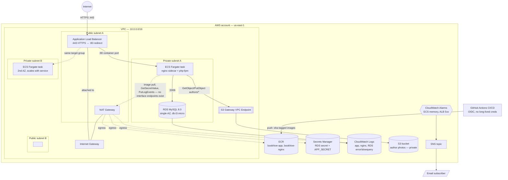

# Architecture — as actually deployed

Last verified against `terraform/network` at commit `e3afcb4` (2026-10-06). If the
Terraform changes, update this diagram in the same PR — it documents what's
really provisioned, not the aspirational plan (see [docs/network-plan.md](network-plan.md)
for that).

## Reading this diagram

- **NAT Gateway is a runtime dependency, not just a build-time one.** The ECS
  task's security group egress comment in `terraform/network/security_groups.tf`
  is explicit: _"Tasks need outbound for ECR/Secrets/S3 via the NAT gateway."_
  There are no VPC interface endpoints for ECR (`api`/`dkr`), Secrets Manager, or
  CloudWatch Logs — only the S3 **gateway** endpoint exists. So every task start
  (image pull + secret fetch) and every log line genuinely leaves the VPC through
  the NAT Gateway today. This is a correction against `docs/network-plan.md`,
  which assumed no runtime outbound calls — that assumption is only true for the
  _application's own logic_, not for the ECS control plane around it.
- **Single NAT Gateway, single AZ (`public_a` only).** Private subnet B's task
  still routes outbound through the same NAT in subnet A — there's no per-AZ
  redundancy, and no AZ-local fallback if that NAT/AZ has an issue.
- **ECS desired_count defaults to 0.** Both task slots in the diagram are
  illustrative of the service's _possible_ placement across 2 AZs, not a
  guarantee two tasks are running — check `terraform output ecs_service_name`
  and the live desired count before assuming steady-state capacity.
- **Not shown because it doesn't exist yet:** Route 53 hosted zone / real domain,
  a CA-issued ACM cert (current cert is a self-signed import), WAF, CloudFront,
  and any VPC interface endpoints.

## Keeping this in sync

Treat drift between this file and `terraform/network/*.tf` as a bug. Quick way
to spot drift: `terraform plan` should show no unexpected changes, and anything
added/removed as a `resource` block (new security group rule, new VPC endpoint,
new subnet) is a prompt to update the diagram in the same change.

